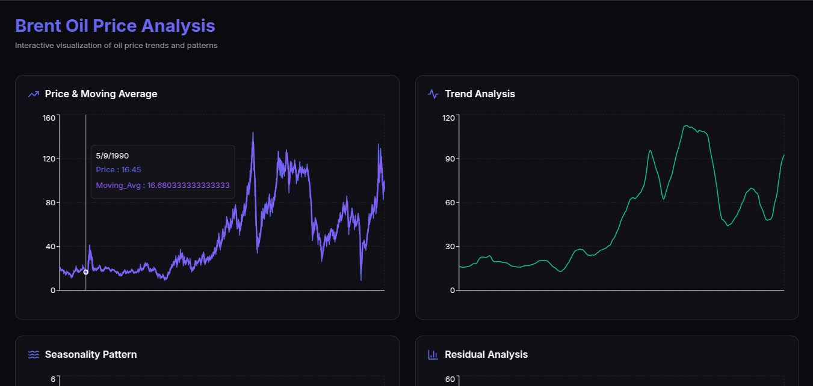

# Brent Oil Price Prediction

This project analyzes the impact of political and economic events on Brent oil prices using time series models, machine learning, and econometric analysis. The tech stack includes Python (ARIMA, LSTM, VAR), Flask, React, and data visualization tools like Recharts and D3.js.



## Project Structure


```
├── api
│   ├── __init__.py
│   ├── serve_model.py
│   └── README.md
├── frontend
│   ├── eslint.config.js
│   ├── index.html
│   ├── node_modules
│   ├── package.json
│   ├── package-lock.json
│   ├── postcss.config.js
│   ├── src
│   │   ├── App.tsx
│   │   ├── index.css
│   │   ├── main.tsx
│   │   └── vite-env.d.ts
│   ├── tailwind.config.js
│   ├── tsconfig.app.json
│   ├── tsconfig.json
│   ├── tsconfig.node.json
│   └── vite.config.ts
├── assets
│   └── images
│       ├── image1.png
│       └── image2.png
├── checkpoints
│   ├── arima_model.pkl
│   ├── garch_model.pkl
│   └── random_forest_model.pkl
├── notebooks
│   ├── 1.0-data-preprocessing.ipynb
│   ├── 2.0-data-exploration.ipynb
│   ├── 3.0-model-training.ipynb
│   ├── 4.0-model-evaluation.ipynb
│   ├── README copy.md
│   └── README.md
├── scripts
│   ├── __init__.py
│   ├── explore_data.py
│   ├── preprocess_data.py
│   ├── train_models.py
│   └── README.md
├── src
│   ├── __init__.py
│   └── README.md
├── tests
│  └── __init__.py
├── logs
│   └── app.log
├── Dockerfile
├── README.md
└── requirements.txt
```


## Installation

1. Clone the repository:
   ```bash
   git clone https://github.com/Naod-Demissie/Brent-Oil-Price-Prediction.git
   cd Brent-Oil-Price-Prediction
   ```

2. Create a virtual environment and install dependencies:
   ```bash
   python -m venv venv
   source venv/bin/activate  # On Windows, use `venv/Scripts/activate`
   pip install -r requirements.txt
   ```

3. **Run the application**:
    ```sh
    python app/serve_model.py
    ```

4. **Access the API**:
    Open your browser and navigate to `http://127.0.0.1:5000`.


## Running the React App

To run the React app, follow these steps:

1. Navigate to the `frontend` directory:
   ```sh
   cd frontend
   ```

2. Install the dependencies:
   ```sh
   npm install
   ```

3. Start the development server:
   ```sh
   npm run dev
   ```

4. Open your browser and navigate to `http://localhost:3000` to view the app.